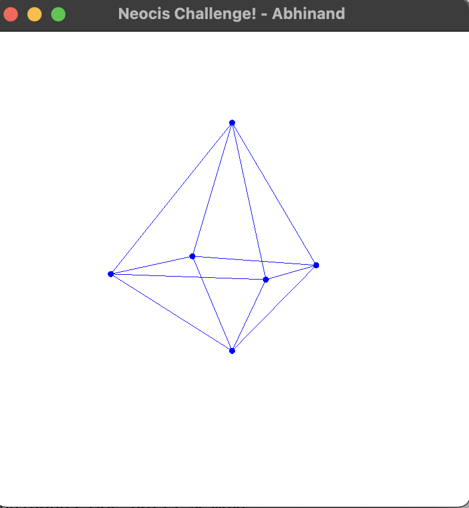
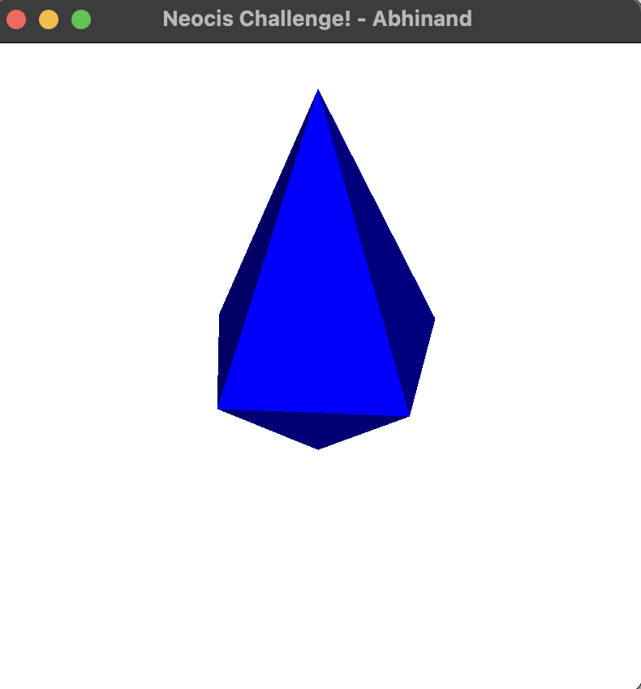

## Challenge
### Part-1

Using 2D graphics only, create a window which will display a 3D object defined by vertices and the edges of the faces of the object. Object can be controlled through the movement of the mouse.
### Part-2

Implement shading of the object based on its relative orientatio.

## Solution
* The directory `part1` contains all the source code and executable for the first challenge and the directory `part2` has the same for the second challenge
* In each directory there are source files `engine.cpp`, `driver.cpp`, `window.cpp` and `mesh.cpp`
* Each directory also has the windows executable `object.exe`
* The executable can be built using the make file as well (more details provided below)
* The executable expects an object file to be provided through the command line, hence it should only be run from the command line (detailed steps provided below)
* The `include` directory contains the header files
* The `obj` directory contains the input data files to be rendered

## Suggested setup for building the code -
This app has been developed using Simple and Fast Multimedia Library (SFML) which is a light-weight library to access the various multimedia components of a system like the mouse and display. Hence, SFML is required to compile and build the executable from scratch. 

To ease the burden of building the binary from scratch, I have also provided a makefile. However, as a prerequisite it is required that SFML be installed on the system and its path must be provided in the makefile. With that said, below are the detailed steps to build the executable from scratch and, also to run the already provided `object.exe` executable.


## Running the executable directly
As mentioned before, the executable expects an input file containing the object information (with clock-wise winding convention for vertices), the executable should be run from the command line/powerShell -

The command should be run from the parent directories (i.e. `\part1` or `\part2`)

```shell
.\object.exe -f <file_path>
```
For example, to run the solution on the provided object file -
```shell
.\object.exe -f obj\object.txt
```

## Building from source
- Install SFML from https://www.sfml-dev.org/download.php
- Open the makefile and update the variable `SFMLPATH` with the path to your SFML installation
- The makefile uses g++ for compilation, please install it separately if you haven't
- Run the makefile
```shell
make all
```

## Results
### Part-1



### Part-2


For a more comprehensive description of the solution and more results please refer to the file `Solution-Report.pdf`
